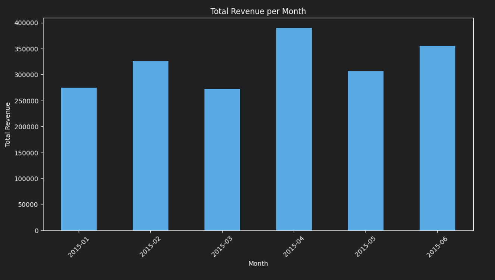
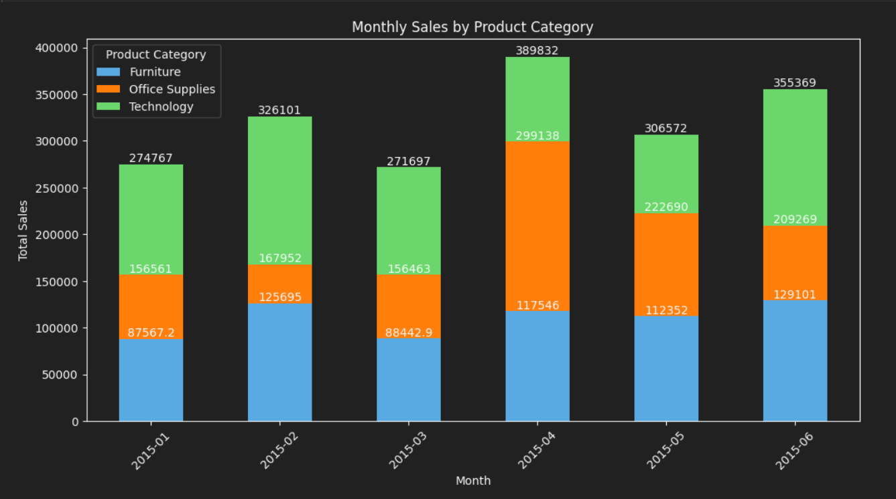
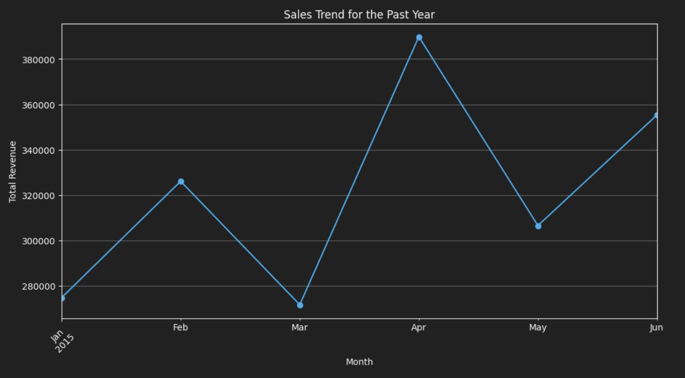
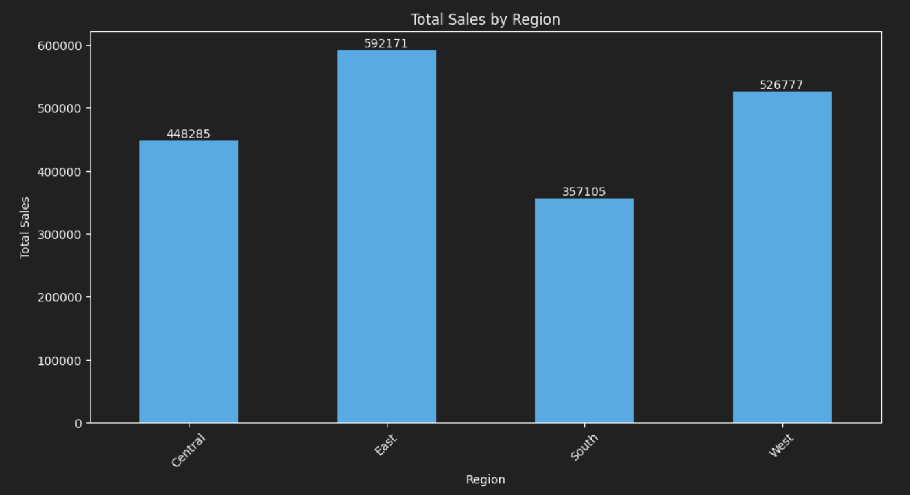
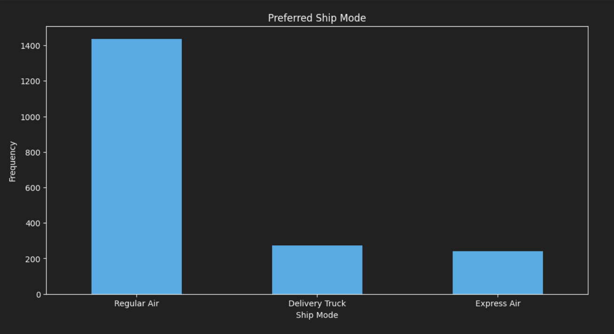

# Marley International Store Sales Analysis (2015)

This project provides a comprehensive analysis of the sales data for Marley International Store for the year 2015. The analysis includes various aspects such as total revenue, category contributions, sales trends, regional performance, profit margins, customer segments, and shipping preferences. The following sections outline the key findings, visualizations, and recommendations based on the analysis.

## Table of Contents
1. [Total Revenue Generated by the Store per Month](#1-total-revenue-generated-by-the-store-per-month)
2. [Category of Products Contributing the Most to Sales per Month](#2-category-of-products-contributing-the-most-to-sales-per-month)
3. [Sales Trend for the Past Year](#3-sales-trend-for-the-past-year)
4. [Region with the Highest and Lowest Sales](#4-region-with-the-highest-and-lowest-sales)
5. [Average Profit Margin of the Store](#5-average-profit-margin-of-the-store)
6. [Best Selling and Most Profitable Category](#6-best-selling-and-most-profitable-category)
7. [Best Selling and Most Profitable Sub-Category](#7-best-selling-and-most-profitable-sub-category)
8. [Top Selling Sub-Category](#8-top-selling-sub-category)
9. [Most Profitable Customer Segment](#9-most-profitable-customer-segment)
10. [Preferred Ship Mode](#10-preferred-ship-mode)
11. [Most Profitable Region](#11-most-profitable-region)
12. [City with the Highest Number of Sales](#12-city-with-the-highest-number-of-sales)

---

### 1. Total Revenue Generated by the Store per Month

**Analysis:**
The total revenue generated by the store per month is as follows:
- January 2015: $274,766.92
- February 2015: $326,101.47
- March 2015: $271,696.67
- April 2015: $389,831.95
- May 2015: $306,572.07
- June 2015: $355,368.80

**Visualization:**


**Recommendation:**
Revenue shows significant fluctuation, with April being the highest. It is recommended to analyze what drives higher sales in specific months to replicate successful strategies.

---

### 2. Category of Products Contributing the Most to Sales per Month

**Analysis:**
Technology products contribute the most to sales each month, with Office Supplies and Furniture following.

**Visualization:**


**Recommendation:**
Focus on promoting technology products, as they are the top contributors to sales. Additionally, consider strategies to boost sales in the other categories.

---

### 3. Sales Trend for the Past Year

**Analysis:**
The sales trend shows fluctuations with a notable peak in April 2015.

**Visualization:**


**Recommendation:**
Investigate the factors leading to peaks and declines to maintain a steady increase in sales.

---

### 4. Region with the Highest and Lowest Sales

**Analysis:**
- Highest sales region: East
- Lowest sales region: South

**Visualization:**


**Recommendation:**
Focus marketing efforts on the South region to boost sales, and continue to strengthen sales strategies in the East region.

---

### 5. Average Profit Margin of the Store

**Analysis:**
The average profit margin of the store is approximately 11.64%.

**Recommendation:**
Aim to increase the profit margin by optimizing costs and enhancing the sales of high-margin products.

---

### 6. Best Selling and Most Profitable Category

**Analysis:**
- Best selling category: Technology
- Most profitable category: Office Supplies

**Recommendation:**
Promote technology products to drive sales volume and office supplies to enhance profitability.

---

### 7. Best Selling and Most Profitable Sub-Category

**Analysis:**
- Best selling sub-category: Office Machines
- Most profitable sub-category: Binders and Binder Accessories

**Recommendation:**
Increase inventory and marketing for Office Machines and Binders and Binder Accessories to maximize both sales and profitability.

---

### 8. Top Selling Sub-Category

**Analysis:**
Office Machines is the top-selling sub-category.

**Recommendation:**
Leverage the popularity of Office Machines by introducing new models and offering promotions.

---

### 9. Most Profitable Customer Segment

**Analysis:**
The most profitable customer segment is Small Business.

**Recommendation:**
Develop targeted marketing campaigns for small businesses to maintain and increase profitability.

---

### 10. Preferred Ship Mode

**Analysis:**
Regular Air is the preferred ship mode.

**Visualization:**


**Recommendation:**
Ensure optimal logistics for Regular Air to maintain customer satisfaction and potentially negotiate better rates with shipping partners.

---

### 11. Most Profitable Region

**Analysis:**
The East region is the most profitable.

**Visualization:**


**Recommendation:**
Continue investing in the East region to sustain profitability, and apply successful strategies from this region to others.

---

### 12. City with the Highest Number of Sales

**Analysis:**
New York City has the highest number of sales.

**Visualization:**


**Recommendation:**
Focus on maintaining a strong presence in New York City and explore expansion opportunities in similar urban markets.

---

Overall, this analysis provides a comprehensive overview of sales, profitability, and strategic areas for improvement and growth for Marley International Store.

---

## How to Run the Analysis

To reproduce this analysis, follow the steps below:

1. **Clone the Repository:**
   ```sh
   git clone https://github.com/kevinndungu-source/Data_Analytics_Project/tree/main/Analysis_using_Python
